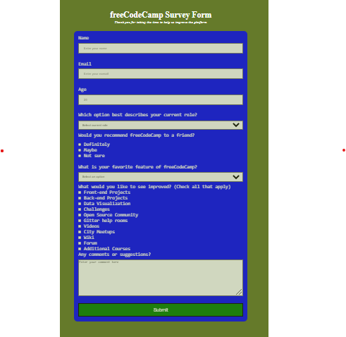

# Survey Form

> It is a project that I made for the Microverse entrance. The project is a simple survey form. I and my partner used Html and CSS to build the project.

## Built With

`HTML`, `CSS` & `JavaScript`

### Prerequisites

- `Git`/`Github`
- VSCode or another equivalent tool

## Getting Started

Clone the project

https://github.com/zmekonnen251/survey-form.git

## Authors

👤 **Zelalem Mekonnen**

- GitHub: [GitHub](https://github.com/zmekonnen251)
- Twitter: [Twitter](https://twitter.com/mek_zela)
- LinkedIn: [Zelalem G. Mekonnen](https://www.linkedin.com/in/zelalem-getachew/)

👤 **RIZWAN HASAN**

- GitHub: [@githubhandle](https://github.com/Rizwan-learn)
- Twitter: [@twitterhandle](https://twitter.com/@rizwanhasan21)
- LinkedIn: [LinkedIn](https://linkedin.com/@rizwanhasan21)

## Live Demo

[live Demo](https://zmekonnen251.github.io/survey-form/)

## 🤝 Contributing

Contributions, issues, and feature requests are welcome!

Feel free to check the [issues page](../../issues/).

## Show your support
